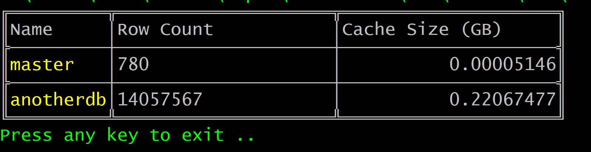

# dexcmd
A command line tool to help with Azure Data Explorer. 

dexcmd is designed to be a lightweight view into a data explorer cluster without using the Azure portal. It currently only contains a single command line switch which can list Azure Data Explorer databases. We're going to develop this as a swiss army knife for ADX databases. As we're currently working a lot with ADX please feel free to add any requests to the issues list or contribute any functions.

Currently supports the use of a App Registration only but in future versions will allow interactive logins. In order for this to work properly the App Registration needs to have access to the Resource Group which the Data Explorer is contained in.

A file called kusto.json should be placed in the bin directory with the following schema.

```json
{
   "application_id": "xxxxxxxx-xxxx-xxxx-xxxx-xxxxxxxxxxxx",
   "application_key": "{my_secret}",
   "tenant_id": "xxxxxxxx-xxxx-xxxx-xxxx-xxxxxxxxxxxx",
   "subscription_id": "xxxxxxxx-xxxx-xxxx-xxxx-xxxxxxxxxxxx",
   "resource_group": "{resource_group_name}",
   "cluster_name": "{cluster_name}"
}
```

Run the command:

*dexcmd --list-databases*

The output for the command should like this.

 

For information on creating a App Registration:

[Creating a service (app registration)](https://docs.microsoft.com/en-us/azure/active-directory/develop/howto-create-service-principal-portal)

Release notes:
1.0.1 - Added --list-tables --databaseName {database name} - which return all of the tables, their sizes and all of the people with access to the table


